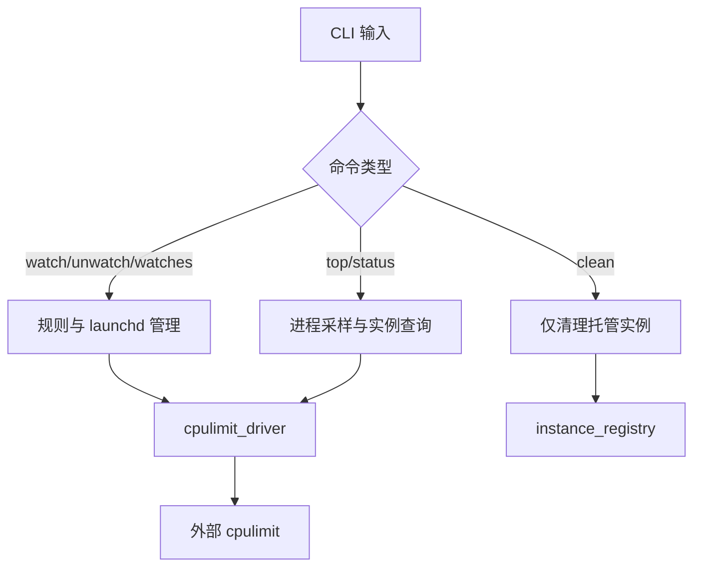

# cpuguard

`cpuguard` 是一个基于 Rust 的 macOS CPU 限速管理工具。
它不重写 `cpulimit` 算法，而是在其上构建：规则管理、进程选择、`launchd` 托管、实例状态追踪与安全清理。

## 设计目标
- 默认低权限运行：默认使用 `launchd` 用户域（`LaunchAgents`）。
- 零误杀清理：`clean` 仅处理本工具托管实例。
- 低常驻开销：`top/status` 单次采样，不重复全表扫描。
- 文档先行：行为和接口以 `docs/` 为准。

## 能力边界（Do / Don't）
### 我们要做的
- 结合进程快照（top-like 视图）帮助用户发现高 CPU 进程并选择目标。
- 打通“发现目标 -> 施加限制 -> 托管/一次性”的完整操作链路。
- 持久化管理 watch 规则（增删改查、状态可见）。
- 通过 `launchd` 在重启后恢复规则生效能力。
- 在 `watch` 启动前检测一次性限速冲突，避免双重限制。

### 我们不要做的
- 不重写 `cpulimit` 的 CPU 节流算法。
- 不做全局模糊 kill（例如 `ps|grep cpulimit` 后批量清理）。
- 不承诺 V1 跨平台（V1 仅 macOS）。
- 不接管或篡改非本工具托管的外部 `cpulimit` 实例。

## V1 命令
- `watch <name> [--limit N]`：新增或更新可执行名规则。
- `unwatch <name>`：删除规则并卸载对应 `launchd` 服务。
- `watches`：查看规则与运行状态。
- `top [--limit N] [--count K]`：展示高 CPU 进程并默认创建 watch 规则。
- `top --once [--limit N] [--count K]`：执行一次性 ad-hoc 限速，不写入规则。
- `status`：查看托管实例状态。
- `clean [--yes]`：清理本工具托管实例与本地状态。
- 全局参数：`--domain user|system`（默认 `user`）。

`watch` 启动前会执行冲突检测：
- 若存在本工具托管的一次性实例（ad-hoc）命中同名目标，则先停止再启动 watch。
- 若存在非本工具托管的外部 `cpulimit` 命中同名目标，则拒绝启动并提示用户先手动处理冲突。

关于“进程暂未启动”的行为：
- `cpulimit -e` 可在目标暂未运行时保持等待，目标出现后再施加限制。
- 因此配合 `launchd` 后，重启场景下即使目标稍后才启动，规则仍可继续生效。

## 依赖
- macOS 14+。
- `cpulimit` 可执行文件。
- Rust stable 工具链。

## 快速开始（开发）
```bash
# 1) 安装 cpulimit (Homebrew)
brew install cpulimit

# 2) 进入仓库
cd /Users/masonxhuang/Documents/code/cpuguard

# 3) 质量检查
cargo fmt --all -- --check
cargo clippy --all-targets --all-features -- -D warnings
cargo test --all
```

## 使用方法
```bash
# 构建
cargo build --release

# 查看帮助
./target/release/cpuguard --help
```

## 发布与安装（二进制）
```bash
# 1) release 构建
cargo build --release

# 2) 安装到 /usr/local/bin（推荐）
sudo install -m 755 ./target/release/cpuguard /usr/local/bin/cpuguard

# 3) 验证
which cpuguard
cpuguard --help
```

说明：
- macOS 上通常不建议安装到 `/usr/bin`（受系统保护机制限制）。
- 优先使用 `/usr/local/bin`（或你的 PATH 中其他可写目录）。

### 1) 从 top 视图选择并默认加入 watch（推荐）
```bash
./target/release/cpuguard top --count 10 --limit 20
```
- 默认行为：选择目标后会创建/更新 watch 规则（持久化）。
- top 视图默认每 5 秒自动刷新一次，可用 `--refresh` 调整刷新间隔（秒）。
- 交互时输入 `q` 退出，输入序号执行限制，直接回车立即刷新。

### 2) 一次性限制（不持久化）
```bash
./target/release/cpuguard top --once --pid 12345 --limit 30
```
- `--once` 才会创建 ad-hoc 实例，不写入 `rules.toml`。

### 3) 直接管理 watch 规则
```bash
# 新增/更新规则
./target/release/cpuguard watch ztsmedr --limit 25

# 查看规则状态（含 launchd 与目标进程状态）
./target/release/cpuguard watches

# 删除规则
./target/release/cpuguard unwatch ztsmedr
```

### 4) 查看托管实例状态与清理
```bash
# 查看托管实例（running/stale）
./target/release/cpuguard status

# 仅清理本工具托管实例
./target/release/cpuguard clean --yes
```

### 5) 域切换（默认 user）
```bash
# 用户域（默认）
./target/release/cpuguard --domain user watches

# 系统域（通常需要更高权限）
./target/release/cpuguard --domain system watch myproc --limit 20
```

## 运行流程概览


## 推荐 Rust 依赖（文档约束）
基于 Context7 查询到的官方 API 能力，V1 建议使用：
- CLI：`clap`（derive 子命令、默认值、全局参数）。
- 序列化：`serde` + `toml` + `serde_json`（规则与状态文件）。
- 进程采样：`sysinfo`（进程刷新与 CPU 读取）。
- 错误处理：`anyhow` + `thiserror`。
- 日志：`tracing` + `tracing-subscriber`。

## 文档导航
- 行为定义：[docs/01-product-behavior.md](./docs/01-product-behavior.md)
- 架构设计：[docs/02-architecture.md](./docs/02-architecture.md)
- CLI 契约：[docs/03-cli-contract.md](./docs/03-cli-contract.md)
- 数据模型：[docs/04-data-model.md](./docs/04-data-model.md)
- 失败模型：[docs/05-failure-model.md](./docs/05-failure-model.md)
- 验收与发布：[docs/06-rollout-and-acceptance.md](./docs/06-rollout-and-acceptance.md)
