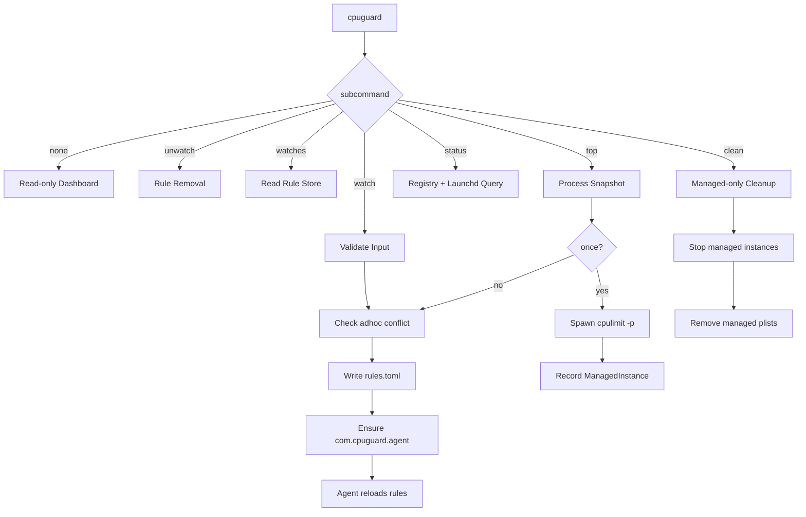
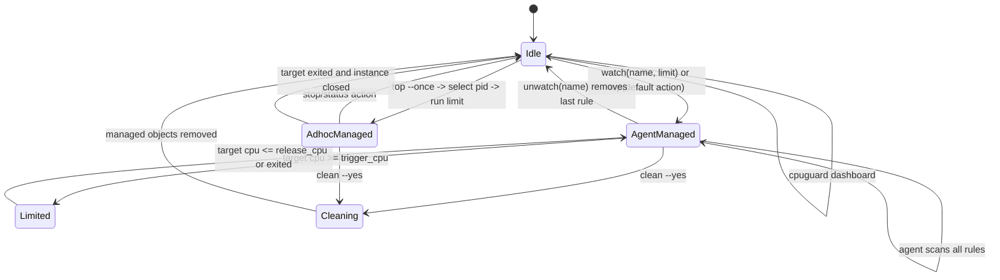

# 01 Product Behavior

## 1. 目标与边界
- 工具职责：对进程施加 CPU 限速策略并维护其生命周期。
- 非职责：不实现 CPU 调度算法，不替代 `cpulimit`。
- 平台：macOS V1。

## 1.1 能力清单（要做）
1. 提供 top-like 的高 CPU 进程视图，帮助用户定位目标。
2. 提供从“查看 -> 选择 -> 限速”的一体化 CLI 流程。
3. 持久化 watch 规则并支持列表与状态管理。
4. 支持重启后自动恢复规则（通过单一 `launchd` agent 托管）。
5. `watch` 启动前检测并处理一次性限速冲突实例。
6. 在 top 视图中自动标记值得排查的高风险进程（PPID=1 + CPU≥阈值 + 运行≥30min + 非系统进程），但不将其断言为孤儿进程。
7. 在 top 视图中默认隐藏终止动作；只有显式 `--allow-kill` 时才支持按当前快照终止单个高风险进程或批量终止同名异常进程（需确认，且禁止对系统进程触发）。

## 1.2 非目标（不要做）
1. 不重写或替代 `cpulimit` 的算法能力。
2. 不实现对非托管外部 `cpulimit` 的强制接管或自动清理。
3. 不使用模糊匹配进行全局清理。
4. 不承诺 V1 跨平台行为一致性。

## 2. 核心行为
1. 无子命令：展示只读 dashboard，包括规则、agent 状态、当前被本工具限制的进程和实例状态；不得进入交互或创建规则。
2. `watch`：将进程名规则持久化，并确保单一 `cpuguard agent` 已通过 `launchd` 托管；启动前必须执行一次性实例冲突检测。
3. `top`：按 CPU 快照选择目标，默认创建 watch 规则并启动托管。
4. `top --once`：按 CPU 快照选择目标，仅创建 ad-hoc 限速实例，不写入规则。
5. `status/watches`：展示规则、实例、目标进程存在性。
6. `unwatch`：删除当前 domain 的规则；若该规则已有 watch 限速实例，命令会先停止并清理这些实例，再按需卸载当前 domain 的 agent。
7. `clean`：仅清理本工具托管实例与状态。
8. `top` 默认交互只负责选择限速目标、刷新和退出；终止类动作属于显式开启的诊断能力。
9. `agent`：常驻但低频运行，一次进程快照服务全部 watch 规则；仅当目标 CPU 连续超过 `trigger_cpu` 时启动 `cpulimit`，当 CPU 连续低于 `release_cpu` 或目标退出时停止托管实例。

## 3. 不变量（Invariants）
- `clean` 不能影响手工启动的 `cpulimit`。
- 所有被托管对象都必须可追溯到 `instance_registry` 或受控 `launchd label`。
- 同一 `(domain, name)` 在 `rules.toml` 中唯一；用户域和系统域允许存在同名规则，互不覆盖。
- CLI 默认域为 `system`。
- `system` 域适合控制 `root` 或系统服务账号拥有的后台目标，相关写入和 `launchd` 操作通常需要 `sudo`；`user` 域只承诺控制当前用户有权限控制的目标，必须显式使用 `--domain user`。
- `cpuguard` 无子命令必须是只读 dashboard；`top` 的默认动作仍是 `watch`，但必须通过显式 `top` 子命令进入。
- `watch` 与重启恢复依赖一个受控 label：`com.cpuguard.agent`；规则是配置数据，不允许为每条规则创建独立开机启动项。
- agent 每轮最多刷新一次进程快照，并用该快照评估全部规则。
- agent 空闲时必须低频扫描，命中热点后才临时提高扫描频率；不得因限速管理自身造成明显 CPU 消耗。
- agent 单轮扫描失败时不得退出进程；必须记录错误并退避后继续下一轮，避免 `launchd` 重启循环。
- watch 限速使用滞回：`trigger_cpu` 触发，`release_cpu` 释放，避免在阈值附近反复启动/停止。
- watch 规则的 `limit` 更新后，agent 必须替换仍在运行的旧限速实例，避免旧 `cpulimit -l` 参数继续生效。
- `top` 的风险提示只是排查线索，不表示进程一定是孤儿或应被终止。
- `top --allow-kill` 的终止动作只允许命中当前快照中的非系统进程，且必须经过显式确认。

## 4. 命令路由图

## 5. 核心状态机（watch/ad-hoc/clean）

## 6. 行为优先级
- 安全 > 正确性 > 性能 > 交互体验。
- 当安全与易用冲突时，默认拒绝并返回可操作错误信息。
- 性能约束属于安全边界的一部分：若限速管理路径异常高频重启、扫描或启动 `cpulimit`，必须 backoff，而不是继续制造负载。

## 7. 冲突处理规则（watch 启动前）
1. 枚举命中 `name` 的一次性限速实例（ad-hoc）。
2. 若实例属于本工具托管：先停止，再继续 watch 启动流程。
3. 若实例不属于本工具托管：返回冲突错误并终止，避免误操作外部实例。

## 8. agent 自动限速策略
1. 域隔离：agent 只评估与自身 `--domain` 一致的规则和托管实例，不得跨用户域/系统域启动、停止或清理实例。
2. 匹配：默认按进程 basename 与规则 `name` 精确匹配；可选 `args_contains` 进一步限定命中范围。
3. 触发：同一 PID 连续 `hot_required_samples` 轮 CPU 大于等于 `trigger_cpu` 后启动 `cpulimit -p <pid>`。
4. 释放：同一 PID 连续 `cold_required_samples` 轮 CPU 小于等于 `release_cpu` 后停止对应 `cpulimit`。
5. 规则更新：已有实例若不再匹配当前规则（例如新增或修改 `args_contains`），或记录的 `limit` 与当前规则不一致，agent 必须停止该实例并清理 state，让后续扫描按最新规则重新启动。
6. 清理：目标 PID 退出、规则删除、`cpulimit` 退出或超出托管上限时，agent 只清理 state 中登记的实例。
7. 去重：当某个 target PID 已有一个 state 登记且存活的托管 `cpulimit` 时，agent 可清理同一 target PID 上其它未登记的重复 `cpulimit`，避免历史残留造成额外负载。
8. backoff：同一 PID 的限速实例异常退出后，短时间内不得无限重启。
