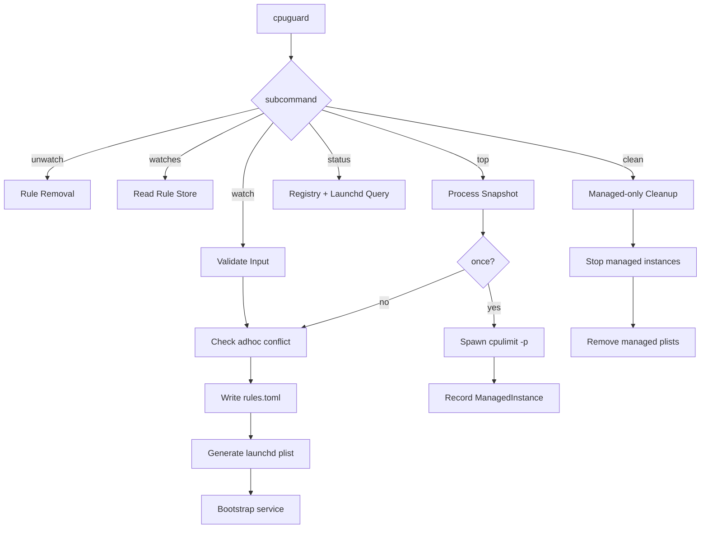
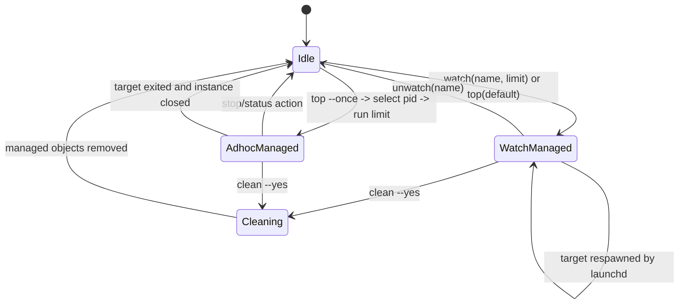

# 01 Product Behavior

## 1. 目标与边界
- 工具职责：对进程施加 CPU 限速策略并维护其生命周期。
- 非职责：不实现 CPU 调度算法，不替代 `cpulimit`。
- 平台：macOS V1。

## 1.1 能力清单（要做）
1. 提供 top-like 的高 CPU 进程视图，帮助用户定位目标。
2. 提供从“查看 -> 选择 -> 限速”的一体化 CLI 流程。
3. 持久化 watch 规则并支持列表与状态管理。
4. 支持重启后自动恢复规则（通过 `launchd` 托管）。
5. `watch` 启动前检测并处理一次性限速冲突实例。

## 1.2 非目标（不要做）
1. 不重写或替代 `cpulimit` 的算法能力。
2. 不实现对非托管外部 `cpulimit` 的强制接管或自动清理。
3. 不使用模糊匹配进行全局清理。
4. 不承诺 V1 跨平台行为一致性。

## 2. 核心行为
1. `watch`：将进程名规则持久化，并通过 `launchd` 持续托管；启动前必须执行一次性实例冲突检测。
2. `top`：按 CPU 快照选择目标，默认创建 watch 规则并启动托管。
3. `top --once`：按 CPU 快照选择目标，仅创建 ad-hoc 限速实例，不写入规则。
4. `status/watches`：展示规则、实例、目标进程存在性。
5. `unwatch`：卸载服务并删除规则。
6. `clean`：仅清理本工具托管实例与状态。

## 3. 不变量（Invariants）
- `clean` 不能影响手工启动的 `cpulimit`。
- 所有被托管对象都必须可追溯到 `instance_registry` 或受控 `launchd label`。
- 同一规则名在 `rules.toml` 中唯一。
- CLI 默认域为 `user`。
- `top` 的默认行为是 `watch`，一次性行为只能通过显式 `--once` 触发。
- `watch` 与重启恢复依赖 `launchd` + `cpulimit -e` 的等待能力（目标未启动时可等待）。

## 4. 命令路由图

## 5. 核心状态机（watch/ad-hoc/clean）

## 6. 行为优先级
- 安全 > 正确性 > 性能 > 交互体验。
- 当安全与易用冲突时，默认拒绝并返回可操作错误信息。

## 7. 冲突处理规则（watch 启动前）
1. 枚举命中 `name` 的一次性限速实例（ad-hoc）。
2. 若实例属于本工具托管：先停止，再继续 watch 启动流程。
3. 若实例不属于本工具托管：返回冲突错误并终止，避免误操作外部实例。
