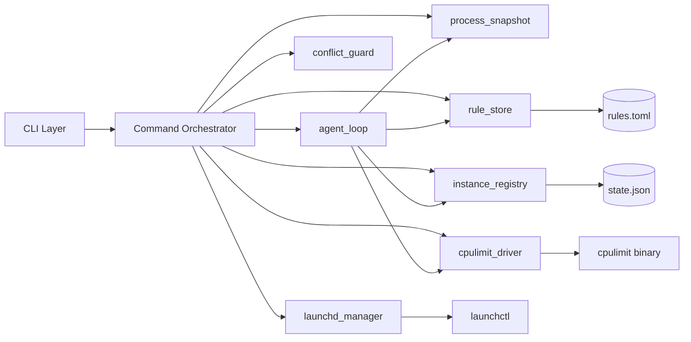
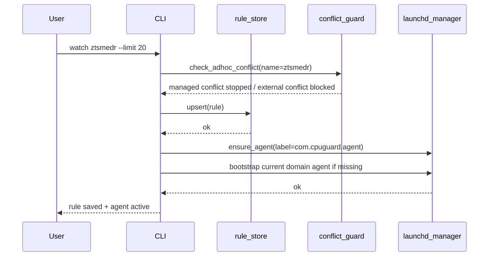
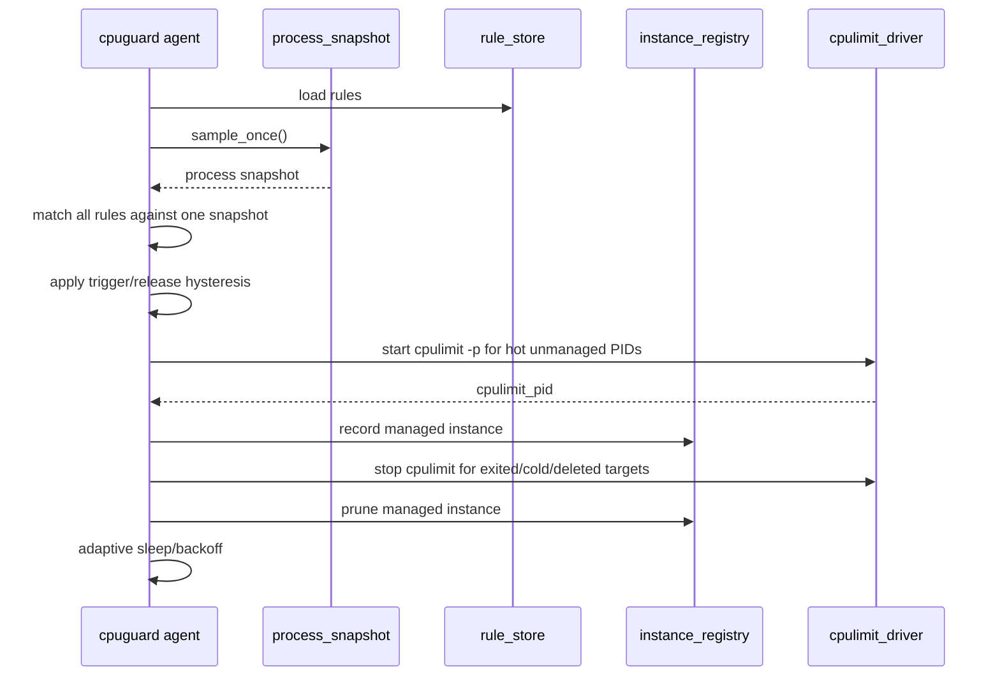
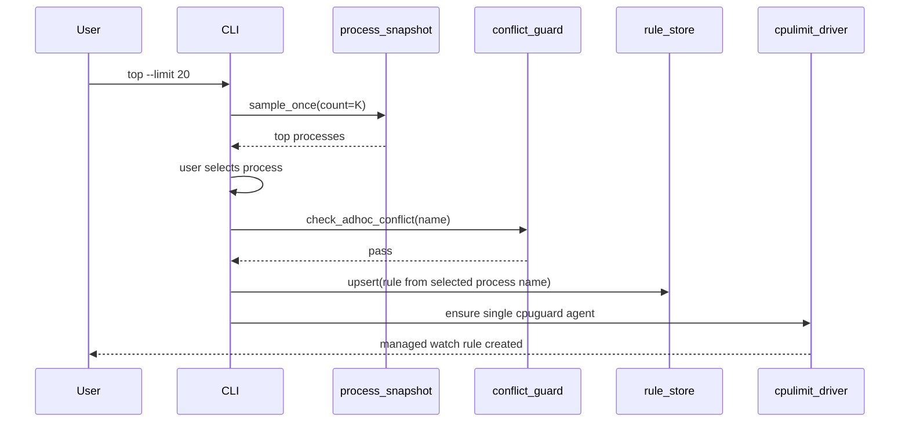
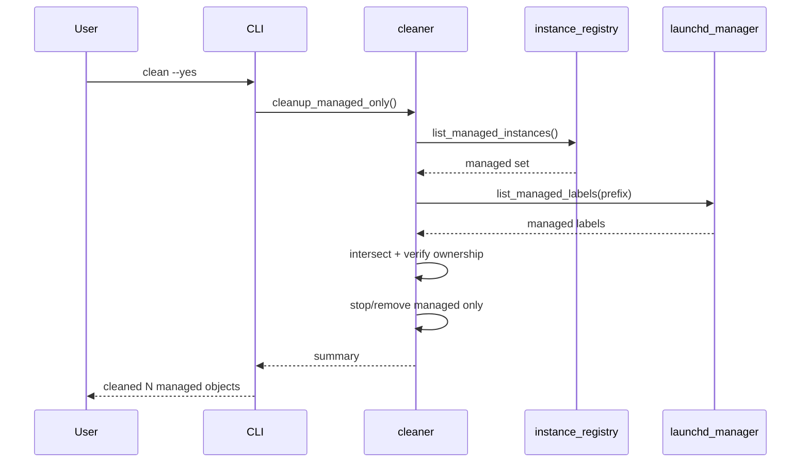

# 02 Architecture

## 1. 模块划分
- `cli`: 参数解析与命令分发（基于 clap derive）。
- `process_snapshot`: 单次刷新进程快照，输出统一模型。
- `cpulimit_driver`: 统一执行 `cpulimit` 命令与参数构造。
- `rule_store`: 读写 `rules.toml`（原子落盘）。
- `launchd_manager`: 生成、加载、卸载单一 `cpuguard agent` 的 `LaunchAgents`/`LaunchDaemons`。
- `instance_registry`: 记录并校验本工具托管实例。
- `conflict_guard`: `watch` 启动前检测并处理 ad-hoc 冲突实例。
- `agent_loop`: 常驻低开销协调器，共享一次进程快照评估全部规则，按需启动/停止外部 `cpulimit`。
- `cleaner`: 托管对象清理编排。

## 2. 组件图


## 3. watch 时序图（单 agent）


## 4. agent 限速时序


## 5. top 行为时序（默认 watch，`--once` 例外）


## 6. clean 时序图（零误杀）


## 7. 依赖边界图
```mermaid
flowchart TD
    A[Business Modules] --> B[OS Adapters]
    B --> C[launchctl]
    B --> D[cpulimit]
    B --> E[process API]

    F[Persistence] --> G[rules.toml]
    F --> H[state.json]

    I[Forbidden in core logic] -.-> J[Global ps|grep fuzzy kill]
    I -.-> K[Per-rule LaunchAgent fan-out]
```

## 8. 关键实现约束
- 所有系统调用通过 adapter 层，便于测试替身。
- `top/status` 在单次命令生命周期内只刷新一次进程快照。
- `clean` 必须在“实例登记 + label 前缀”双重验证通过后执行。
- `watch` 和 `top` 默认托管路径在启动前必须走 `conflict_guard`。
- `watch` 和 `top` 默认托管路径只能确保单一 `com.cpuguard.agent`，不得为每条规则生成独立 plist。
- agent 共享一次进程快照评估全部规则；规则数量增长不应线性增加扫描次数。
- agent 使用 `trigger_cpu`/`release_cpu` 滞回和异常 backoff，避免 `launchd` 高速重启或 `cpulimit` 高频重建。
- 对于 state 中已经登记且存活的 target PID，agent 每轮会收敛同 target 上未登记的重复 `cpulimit`；没有 state 托管关系的外部 `cpulimit` 仍不自动接管或清理。
