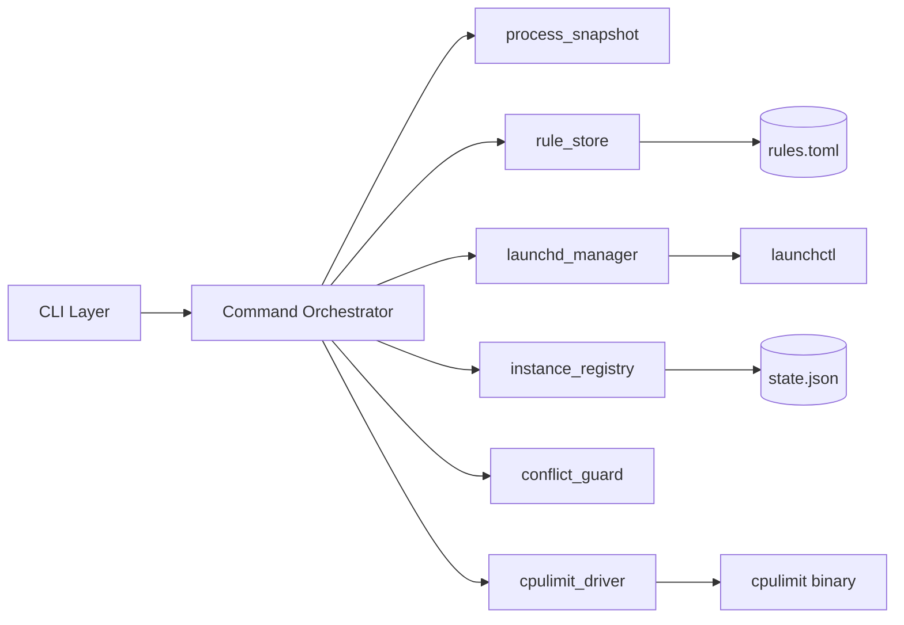
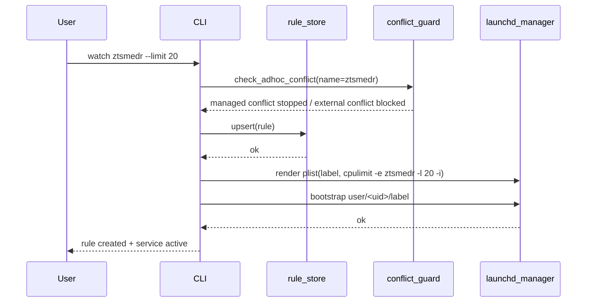
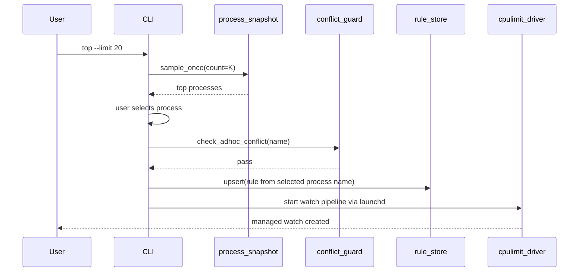
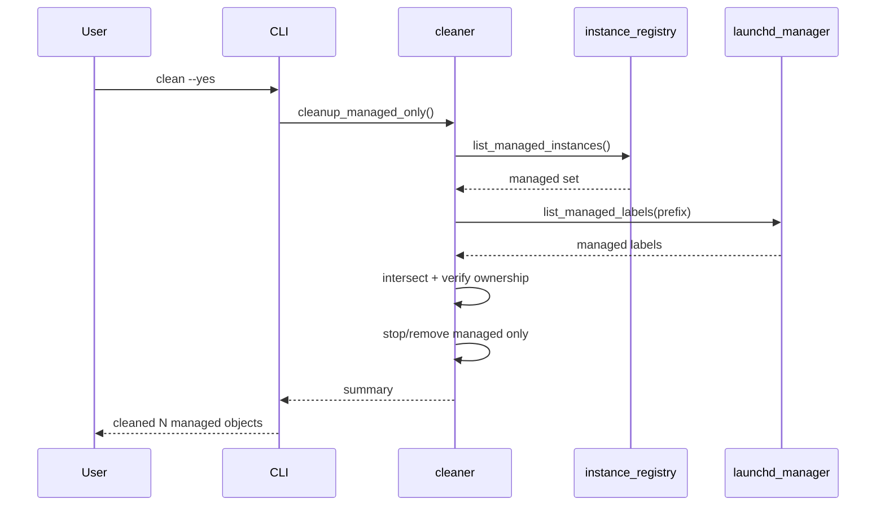

# 02 Architecture

## 1. 模块划分
- `cli`: 参数解析与命令分发（基于 clap derive）。
- `process_snapshot`: 单次刷新进程快照，输出统一模型。
- `cpulimit_driver`: 统一执行 `cpulimit` 命令与参数构造。
- `rule_store`: 读写 `rules.toml`（原子落盘）。
- `launchd_manager`: 生成、加载、卸载 `LaunchAgents`/`LaunchDaemons`。
- `instance_registry`: 记录并校验本工具托管实例。
- `conflict_guard`: `watch` 启动前检测并处理 ad-hoc 冲突实例。
- `cleaner`: 托管对象清理编排。

## 2. 组件图


## 3. watch 时序图


## 4. top 行为时序（默认 watch，`--once` 例外）


## 5. clean 时序图（零误杀）


## 6. 依赖边界图
```mermaid
flowchart TD
    A[Business Modules] --> B[OS Adapters]
    B --> C[launchctl]
    B --> D[cpulimit]
    B --> E[process API]

    F[Persistence] --> G[rules.toml]
    F --> H[state.json]

    I[Forbidden in core logic] -.-> J[Global ps|grep fuzzy kill]
```

## 7. 关键实现约束
- 所有系统调用通过 adapter 层，便于测试替身。
- `top/status` 在单次命令生命周期内只刷新一次进程快照。
- `clean` 必须在“实例登记 + label 前缀”双重验证通过后执行。
- `watch` 和 `top` 默认托管路径在启动前必须走 `conflict_guard`。
