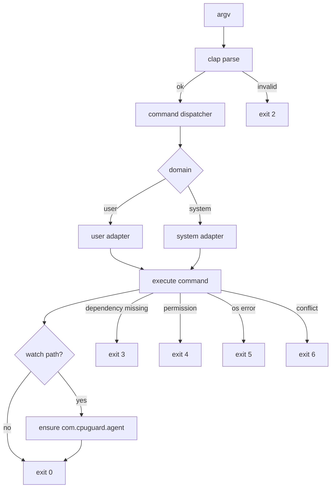

# 03 CLI Contract

## 1. 命令总览
| 命令 | 说明 | 必选参数 | 可选参数 |
|---|---|---|---|
| `watch <name>` | 新增或更新规则并确保单 agent 托管 | `name` | `--limit <N>`, `--trigger-cpu <F>`, `--release-cpu <F>`, `--args-contains <TEXT>` |
| `unwatch <name>` | 删除规则并由 agent 清理对应实例 | `name` | 无 |
| `watches` | 查看规则状态 | 无 | 无 |
| `top` | 展示高 CPU 进程并默认创建 watch 规则 | 无 | `--limit <N>`, `--count <K>`, `--refresh <S>`, `--once`, `--risk-cpu <F>`, `--allow-kill` |
| `status` | 查看当前 domain 的托管实例状态 | 无 | 无 |
| `clean` | 清理本工具托管对象 | 无 | `--yes` |
| `install-agent` | 安装/刷新当前 domain 的单一 agent | 无 | 无 |
| 无子命令 | 只读 dashboard，展示规则、agent 状态与当前被限制进程 | 无 | 无 |

全局参数：`--domain <user|system>`（默认 `system`）。

域语义：
- `system`：默认域，生成 `/Library/LaunchDaemons/com.cpuguard.agent.plist`，默认配置目录为 `/Library/Application Support/cpuguard`，通常需要 `sudo` 写入。目标进程由 `root` 或系统服务账号拥有时，只有系统域 agent 才能让外部 `cpulimit` 实际控制目标。
- `user`：生成 `~/Library/LaunchAgents/com.cpuguard.agent.plist`，默认配置目录为 `~/.config/cpuguard`，适合当前用户拥有的进程，必须显式传入 `--domain user`。
- `CPULIMIT_TOP_CONFIG_DIR` 存在时覆盖上述默认配置目录，主要用于测试或显式迁移场景。

## 2. 参数约束
- `--limit`: 整数，范围 `1..=1200`。
- `--count`: 整数，范围 `1..=100`，默认 `10`。
- `--refresh`: 整数秒，最小 `1`，默认 `5`。
- `--once`: 仅用于 `top`，表示一次性 ad-hoc 限速，不写入规则。
- `--risk-cpu`: 浮点数，默认 `50.0`。`top` 风险提示的 CPU 阈值（百分比）。兼容旧参数名 `--orphan-cpu`。
- `--allow-kill`: 仅用于 `top`。默认不启用；启用后才允许交互式 `k<序号>` / `x<序号>` 发送 `SIGTERM`。
- `--trigger-cpu`: 浮点数，默认 `25.0`。watch 规则触发限速的 CPU 阈值。
- `--release-cpu`: 浮点数，默认 `8.0`。watch 规则释放限速的 CPU 阈值，必须小于等于 `--trigger-cpu`。
- `--args-contains`: 字符串。可选命令行参数包含匹配，用于区分同名子进程。
- `name`: 可执行名（basename），非空。

## 3. 命令语义细则
1. 无子命令时只输出 dashboard，不进入交互，不写规则，不启动或停止 `cpulimit`。
2. dashboard 必须展示：
   - 当前规则及其 `launchd` 状态。
   - 当前 `--domain` 的 `com.cpuguard.agent` 加载状态。
   - 当前 domain 由 `instance_registry` 记录的托管实例。
   - 每个托管实例对应的目标 PID、目标名、`cpulimit_pid`、running/stale 状态。
3. `top` 默认等价于“选择进程后执行 `watch <name> --limit <N>`”，并继承 watch 默认阈值。
4. `top --once` 才创建 ad-hoc 实例，并记录到 `instance_registry`。
5. `top` 表格中 PPID=1 且 CPU ≥ `--risk-cpu` 且运行时间 ≥ 30 分钟且非已知系统进程的进程，标记为风险提示（`RISK` 列显示 `HIGH`）。该标记只表示值得排查，不表示进程一定是孤儿或应被终止。
6. `top` 表格必须包含 `LIMITED` 列；当当前行 PID 命中 `instance_registry` 中 running 的托管实例目标 PID 时，显示 `YES`，否则为空。
7. `top` 默认交互只允许输入序号创建限速、`q` 退出或回车刷新；不得展示或执行 kill 类动作。
8. 仅当显式传入 `--allow-kill` 时，`top` 交互才允许：
   - `k<序号>`：终止被 `RISK=HIGH` 标记的单个进程（需确认）。
   - `x<序号>`：批量终止当前表格中与所选条目 `NAME` 完全相同的非系统进程（需确认）。
   - 上述能力仅作用于当前快照，不做全局模糊匹配，且禁止对系统进程触发。
9. `watch` 在启动前必须执行冲突检测：
   - 托管 ad-hoc 冲突：仅匹配当前 `domain`、同名且满足 `args_contains` 选择器的实例；命中时自动停止后继续。
   - 非托管外部冲突：仅匹配同名且满足 `args_contains` 选择器的外部 `cpulimit`；命中时返回冲突错误并中止。
   - `args_contains` 为空时沿用同名匹配；存在时目标进程完整命令行必须包含该文本才算冲突。
10. `watch` 必须先持久化规则，再确认单一 agent 可用；若 agent 安装/加载失败，必须恢复写入前的规则文件，不得留下已写入但无法生效的新规则。
    - 若存在待替换的托管 ad-hoc 限速，必须先完成外部冲突检测、agent 确认和规则持久化，再停止旧 ad-hoc，避免失败路径提前移除仍有效的限速保护。
    - 若旧 ad-hoc 停止或 state 清理失败，必须恢复写入 watch 前的规则文件，避免命令返回错误但留下部分生效的 watch 规则。
    - 若同一规则命中多个托管 ad-hoc 限速，自动替换必须拒绝执行并让用户先显式清理，避免半途失败造成部分限速被移除。
11. `watch` 的 `launchd` job 必须是单一 `com.cpuguard.agent`，由 agent 读取所有规则并启动 `cpulimit -p`；不得为每条规则创建独立 `LaunchAgent`，也不得直接托管等待中的 `cpulimit -e`。
12. agent 每轮共享一次进程快照，使用 `trigger_cpu`/`release_cpu` 滞回：
   - agent 只处理与自身 `--domain` 一致的规则和托管实例。
   - 同一 PID 连续达到触发条件才启动限速。
   - 同一 PID 连续达到释放条件才停止限速。
   - `args_contains` 存在时，目标进程完整命令行必须包含该文本。
13. 当已有托管实例不再匹配当前规则（包括 `args_contains` 更新后不再命中）时，agent 必须停止该实例并清理 state。
14. 当已有 watch 实例记录的 `limit` 与当前规则 `limit` 不一致时，agent 必须停止该实例并清理 state，后续扫描按最新 `limit` 重新启动 `cpulimit`。
15. agent 对单个 target 的启动或 state 记录失败不得终止整个 agent；必须对该 target 进入 backoff，并继续评估其它规则。
16. agent 单轮扫描发生 I/O、解析或进程采样错误时不得退出；必须记录错误并按空闲 backoff 间隔继续下一轮。
17. agent 对已登记的托管 target PID 必须执行重复实例收敛：登记的 `cpulimit_pid` 存活时保留该实例，并只停止同一 target PID 上未登记到 state 的其它 `cpulimit -p <pid>`；登记的 `cpulimit_pid` 已退出但 target 仍存活时，必须先停止同 target 上未登记到 state 的其它 `cpulimit -p <pid>`，再清理 stale state 并进入 backoff。其它 domain 或其它 mode 已登记的 managed `cpulimit_pid` 不得被当作重复实例清理。
18. `ensure-agent`/`install-agent` 更新已加载的 launchd agent 时必须实际 reload 运行中的 job；若旧 job bootout 或新 job bootstrap 失败，必须恢复旧 plist；若旧 job 先前处于 loaded 状态且已 bootout，还必须尝试重新 bootstrap 旧 job。新 agent 已成功 bootstrap 后，旧版 legacy `com.cpuguard.*` plist 清理是 best-effort；清理失败不得让已成功的 agent 安装/刷新命令返回失败。
19. `unwatch <name>` 必须先成功停止当前 domain 下该规则名对应的 watch 实例，再删除规则和 state；若停止失败，不得删除规则或 state。删除当前 domain 最后一条规则后必须卸载对应 agent；若卸载失败，必须恢复删除前的规则文件并返回错误。
20. 跨 domain 的 cpuguard 托管 ad-hoc 实例不得被误报为外部 `cpulimit` 冲突；冲突检测应跳过 state 中登记的全部 managed ad-hoc `cpulimit_pid`，但只自动停止当前 domain 且匹配选择器的 managed ad-hoc 实例。
21. `status` 只展示当前 domain 的实例，并包含 `DOMAIN` 列。
22. `watches` 只展示当前 `--domain` 的规则，并必须包含 `HINT` 列；当 user-domain 规则已加载、目标 PID 存在、但当前 domain 没有该规则的 running watch 实例，且目标 owner 不是当前用户时，提示 `use --domain system`。
23. `clean --yes` 可清理受控 `com.cpuguard.agent` 和旧版 legacy `com.cpuguard.*` plist；不得按进程名模糊清理外部 `cpulimit`。`clean` 必须先成功停止当前 domain 的托管实例，再删除对应规则并卸载当前 domain 的 agent；若任一托管实例停止失败，不得删除该实例 state 或该 domain 规则，且 agent 必须保持可服务状态；若 agent 卸载失败，必须恢复删除前的规则文件并返回错误。

## 4. 返回码规范
- `0`: 成功。
- `2`: 参数错误或输入非法。
- `3`: 依赖缺失（如 `cpulimit` 不存在）。
- `4`: 权限不足（如系统域无权限，或 system-domain `launchctl` 返回授权/权限失败）。
- `5`: 系统调用失败（launchd / 进程查询失败）。
- `6`: 状态冲突（外部 ad-hoc 冲突、实例不存在、规则重复但未允许覆盖等）。

## 5. 错误文案规范
- 面向用户：简短、可执行。
- 必须包含：失败原因 + 下一步建议。
- 示例：
  - `cpulimit not found. Install via: brew install cpulimit`
  - `permission denied for system domain. Retry with sudo or use --domain user`
  - `external cpulimit conflict detected for <name>. stop it first or use --once`

## 6. 输入输出流图

## 7. clap 设计约束
- 使用 `#[derive(Parser)]` + `#[derive(Subcommand)]`。
- 全局参数通过顶层 struct 定义并传递到子命令。
- 默认值使用 `#[arg(default_value_t = ...)]`，避免手写分支。
