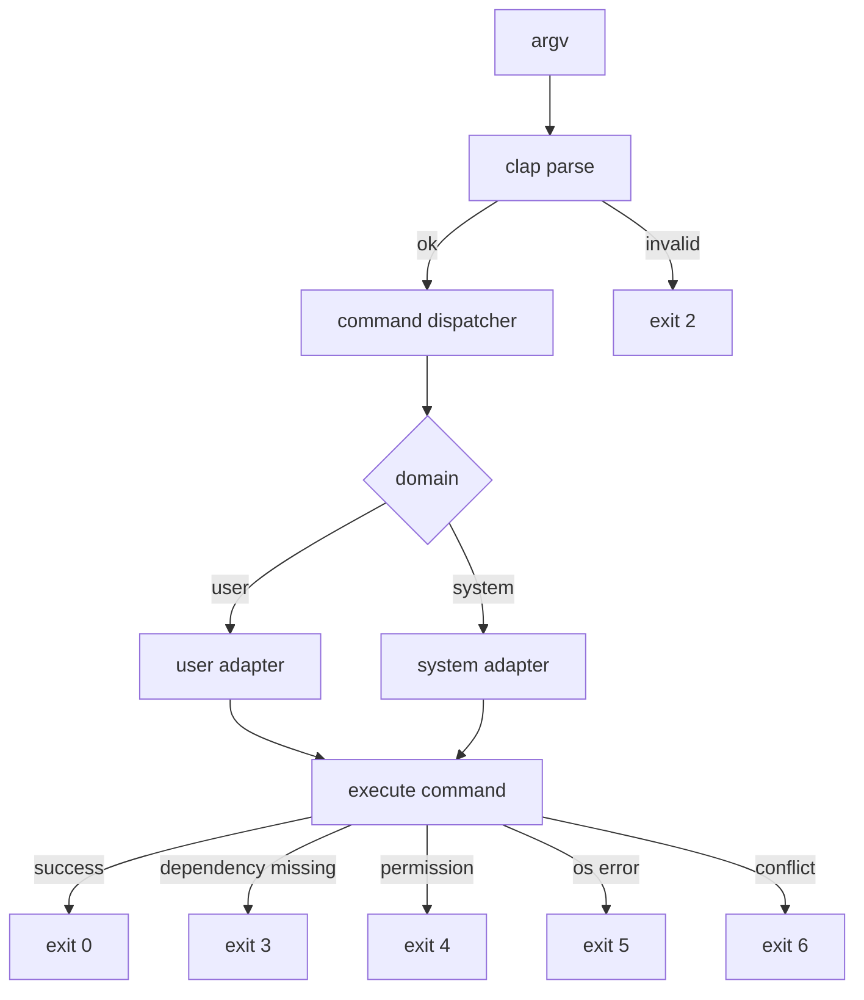

# 03 CLI Contract

## 1. 命令总览
| 命令 | 说明 | 必选参数 | 可选参数 |
|---|---|---|---|
| `watch <name>` | 新增或更新规则并托管 | `name` | `--limit <N>` |
| `unwatch <name>` | 删除规则并移除服务 | `name` | 无 |
| `watches` | 查看规则状态 | 无 | 无 |
| `top` | 展示高 CPU 进程并默认创建 watch 规则 | 无 | `--limit <N>`, `--count <K>`, `--refresh <S>`, `--once`, `--orphan-cpu <F>` |
| `status` | 查看托管实例状态 | 无 | 无 |
| `clean` | 清理本工具托管对象 | 无 | `--yes` |

全局参数：`--domain <user|system>`（默认 `user`）。

## 2. 参数约束
- `--limit`: 整数，范围 `1..=1200`。
- `--count`: 整数，范围 `1..=100`，默认 `10`。
- `--refresh`: 整数秒，最小 `1`，默认 `5`。
- `--once`: 仅用于 `top`，表示一次性 ad-hoc 限速，不写入规则。
- `--orphan-cpu`: 浮点数，默认 `50.0`。可疑孤儿进程的 CPU 阈值（百分比）。
- `name`: 可执行名（basename），非空。

## 3. 命令语义细则
1. `top` 默认等价于“选择进程后执行 `watch <name> --limit <N>`”。
2. `top --once` 才创建 ad-hoc 实例，并记录到 `instance_registry`。
3. `top` 表格中 PPID=1 且 CPU ≥ `--orphan-cpu` 且运行时间 ≥ 30 分钟且非已知系统进程的进程，标记为可疑孤儿（ORPHAN 列显示 `*YES*`）。用户可输入 `k<序号>` 终止孤儿进程（需确认）。
4. `top` 交互时用户可输入 `x<序号>`，批量终止当前表格中与所选条目 `NAME` 完全相同的进程（需确认）。该能力仅作用于当前快照，不做全局模糊匹配，且禁止对系统进程触发。
5. `watch` 在启动前必须执行冲突检测：
   - 托管 ad-hoc 冲突：自动停止后继续。
   - 非托管外部冲突：返回冲突错误并中止。
6. `watch` 的 `launchd` job 必须托管 `cpuguard` runner，由 runner 启动 `cpulimit -p`；不得直接托管等待中的 `cpulimit -e`。
7. `clean --yes` 可清理受控 `com.cpuguard.*` launchd label，包括旧版 legacy plist；不得按进程名模糊清理外部 `cpulimit`。

## 4. 返回码规范
- `0`: 成功。
- `2`: 参数错误或输入非法。
- `3`: 依赖缺失（如 `cpulimit` 不存在）。
- `4`: 权限不足（如系统域无权限）。
- `5`: 系统调用失败（launchd / 进程查询失败）。
- `6`: 状态冲突（外部 ad-hoc 冲突、实例不存在、规则重复但未允许覆盖等）。

## 5. 错误文案规范
- 面向用户：简短、可执行。
- 必须包含：失败原因 + 下一步建议。
- 示例：
  - `cpulimit not found. Install via: brew install cpulimit`
  - `permission denied for system domain. Retry with sudo or use --domain user`
  - `external cpulimit conflict detected for <name>. stop it first or use --once`

## 6. 输入输出流图

## 7. clap 设计约束（基于 Context7）
- 使用 `#[derive(Parser)]` + `#[derive(Subcommand)]`。
- 全局参数通过顶层 struct 定义并传递到子命令。
- 默认值使用 `#[arg(default_value_t = ...)]`，避免手写分支。
