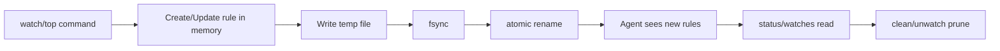

# 04 Data Model

## 1. 文件位置
- 规则文件：`~/.config/cpuguard/rules.toml`
- 实例状态：`~/.config/cpuguard/state.json`

## 2. Rule
```rust
Rule {
  name: String,
  limit: u16,          // 1..=1200
  trigger_cpu: f32,    // 默认 25.0
  release_cpu: f32,    // 默认 8.0，必须 <= trigger_cpu
  args_contains: Option<String>,
  domain: Domain,      // user | system
  created_at: DateTime,
  updated_at: DateTime,
}
```

规则唯一键为 `(domain, name)`。同一域内同名规则会被更新；不同域允许同名规则并存。

### rules.toml 示例
```toml
version = 2

[[rules]]
name = "ztsmedr"
limit = 20
trigger_cpu = 25.0
release_cpu = 8.0
domain = "user"
created_at = "2026-03-05T11:00:00+08:00"
updated_at = "2026-03-05T11:00:00+08:00"

[[rules]]
name = "iOABiz"
limit = 20
trigger_cpu = 20.0
release_cpu = 6.0
args_contains = "NGNAuditXPCClient"
domain = "user"
created_at = "2026-03-05T11:00:00+08:00"
updated_at = "2026-03-05T11:00:00+08:00"
```

## 3. ManagedInstance
```rust
ManagedInstance {
  id: String,
  mode: ManagedMode,           // adhoc | watch
  cpulimit_pid: u32,
  target: ManagedTarget,        // pid(u32) | name(String)
  rule_name: Option<String>,    // watch 实例填规则名
  last_observed_cpu: Option<f32>,
  domain: Domain,               // user | system
  started_at: DateTime,
  owner_label: Option<String>,  // watch 场景填 com.cpuguard.agent
}
```

### state.json 示例
```json
{
  "version": 2,
  "instances": [
    {
      "id": "ins_01JNN4K7D1",
      "mode": "adhoc",
      "cpulimit_pid": 22341,
      "target": { "kind": "pid", "value": 9211 },
      "rule_name": null,
      "last_observed_cpu": null,
      "domain": "user",
      "started_at": "2026-03-05T11:02:00+08:00",
      "owner_label": null
    },
    {
      "id": "ins_01JNN4Q8W2",
      "mode": "watch",
      "cpulimit_pid": 22402,
      "target": { "kind": "pid", "value": 21495 },
      "rule_name": "ztsmedr",
      "last_observed_cpu": 36.2,
      "domain": "user",
      "started_at": "2026-03-05T11:03:00+08:00",
      "owner_label": "com.cpuguard.agent"
    }
  ]
}
```

## 4. agent 运行态内存模型
以下字段不要求全部持久化，agent 可在进程内维护：
```rust
TargetRuntime {
  hot_samples: u8,
  cold_samples: u8,
  backoff_until: Option<DateTime>,
}
```

持久化 state 只用于 `status`、`clean` 和异常恢复；阈值计数与 backoff 可在 agent 重启后重新学习。

## 5. 原子写策略
- 临时文件写入：`*.tmp`。
- `fsync` 临时文件。
- `rename` 覆盖目标文件（同目录原子替换）。
- 读取失败时回退到备份副本并发出告警。

## 6. 数据生命周期图


## 7. 序列化约束
- 类型统一使用 `serde` 的 `Serialize/Deserialize` derive。
- 枚举使用可读字符串表示，避免数值判定分支。
- schema 变更必须提升 `version` 并提供迁移逻辑。
- v1 watch 实例可能缺失 `rule_name`；读取时必须兼容，按 `target` 当前进程名回退匹配同 domain 规则或 `unwatch <name>`。如果 legacy target PID 已退出且无法确认规则名，`unwatch <name>` 不得猜测归属并清理 unrelated state，应留给 `clean` 或后续显式迁移处理。
- 任意写入 `state.json` 的路径都必须将 `version` 提升为 `2`，避免新字段写入旧 schema 标记下。
