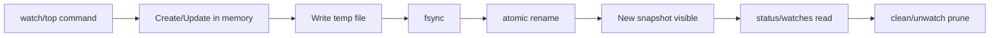

# 04 Data Model

## 1. 文件位置
- 规则文件：`~/.config/cpuguard/rules.toml`
- 实例状态：`~/.config/cpuguard/state.json`

## 2. Rule
```rust
Rule {
  name: String,
  limit: u16,          // 1..=1200
  domain: Domain,      // user | system
  created_at: DateTime,
  updated_at: DateTime,
}
```

### rules.toml 示例
```toml
version = 1

[[rules]]
name = "ztsmedr"
limit = 20
domain = "user"
created_at = "2026-03-05T11:00:00+08:00"
updated_at = "2026-03-05T11:00:00+08:00"
```

## 3. ManagedInstance
```rust
ManagedInstance {
  id: String,
  mode: ManagedMode,           // adhoc | watch
  cpulimit_pid: u32,
  target: ManagedTarget,        // pid(u32) | name(String)
  domain: Domain,               // user | system
  started_at: DateTime,
  owner_label: Option<String>,  // watch 场景填 launchd label
}
```

### state.json 示例
```json
{
  "version": 1,
  "instances": [
    {
      "id": "ins_01JNN4K7D1",
      "mode": "adhoc",
      "cpulimit_pid": 22341,
      "target": { "kind": "pid", "value": 9211 },
      "domain": "user",
      "started_at": "2026-03-05T11:02:00+08:00",
      "owner_label": null
    }
  ]
}
```

## 4. 原子写策略
- 临时文件写入：`*.tmp`。
- `fsync` 临时文件。
- `rename` 覆盖目标文件（同目录原子替换）。
- 读取失败时回退到备份副本并发出告警。

## 5. 数据生命周期图


## 6. 序列化约束（基于 Context7）
- 类型统一使用 `serde` 的 `Serialize/Deserialize` derive。
- 枚举使用可读字符串表示，避免数值判定分支。
- schema 变更必须提升 `version` 并提供迁移逻辑。
