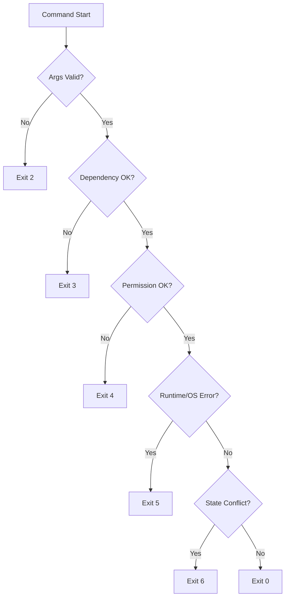

# 05 Failure Model

## 1. 错误分类
1. 依赖错误：`cpulimit` 不存在或不可执行。
2. 权限错误：系统域操作无权限。
3. 目标错误：目标进程不存在或已退出。
4. 系统调用错误：`launchctl`/文件 IO 失败。
5. 状态冲突：规则重复、实例缺失、数据不一致。
6. 外部冲突：检测到非本工具托管的一次性 `cpulimit` 与待启动 watch 命中同名目标。

## 2. 处理原则
- Fail fast：参数和依赖先检查。
- 可恢复优先：失败后保持数据结构可继续运行。
- 幂等：`unwatch` 和 `clean` 重复执行不会造成额外破坏。
- 用户可操作：错误提示给出下一步建议。

## 3. 决策树

## 4. clean 风险控制
- 输入：`instance_registry` 和受控 label 列表。
- 只处理集合交集内对象。
- 任一对象无法归属则跳过并记录 warning，不进行模糊 kill。

## 5. watch 冲突控制
- 检测目标：命中 `name` 的 ad-hoc 限速实例。
- 处理顺序：
  1. 托管实例：停止并从 registry 清理，再继续 watch 启动。
  2. 外部实例：直接返回冲突（退出码 `6`），不执行后续写规则与启动操作。

## 6. 观测与日志
- 日志字段最少包含：`command`, `domain`, `instance_id`, `rule_name`, `error_kind`。
- 对用户输出简洁，对调试日志包含 OS 错误上下文。
