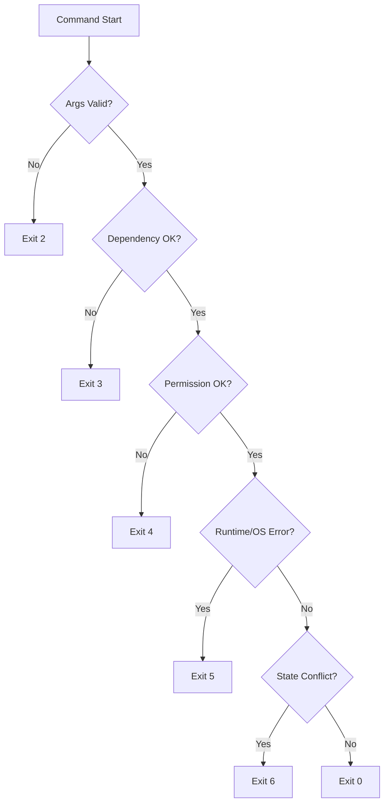

# 05 Failure Model

## 1. 错误分类
1. 依赖错误：`cpulimit` 不存在或不可执行。
2. 权限错误：系统域操作无权限。
3. 目标错误：目标进程不存在或已退出。
4. 系统调用错误：`launchctl`/文件 IO 失败。
5. 状态冲突：规则重复、实例缺失、数据不一致。
6. 外部冲突：检测到非本工具托管的一次性 `cpulimit` 与待启动 watch 命中同名目标。
7. 自身开销异常：agent 或托管 `cpulimit` 反复异常退出、高频重启或超出实例上限。

## 2. 处理原则
- Fail fast：参数和依赖先检查。
- 可恢复优先：失败后保持数据结构可继续运行。
- 幂等：`unwatch` 和 `clean` 重复执行不会造成额外破坏。
- 用户可操作：错误提示给出下一步建议。

## 3. 决策树

## 4. clean 风险控制
- 输入：`instance_registry` 和受控 label 列表。
- 只处理 state 中登记的托管 `cpulimit_pid`、单一 `com.cpuguard.agent`，以及旧版受控 `com.cpuguard.*` plist。
- 任一对象无法归属则跳过并记录 warning，不进行模糊 kill。
- 当前 domain 的托管 `cpulimit` 停止失败时，必须保留对应 state 和规则，让后续 `status`/`clean` 仍可追踪；不得把仍存活的托管限速器变成未登记进程。
- 外部执行器的 `stop_instance` 只有在确认 `cpulimit_pid` 已退出后才能返回成功；仅成功发送 `SIGTERM` 不代表停止完成。
- 当前 domain 的 agent 卸载失败时，`clean`/`unwatch` 必须返回错误，不得静默报告成功。
- `clean` 在所有托管实例停止成功前不得卸载 agent；否则停止失败会留下有规则和 state 但无 agent 服务的 domain。
- `clean`/`unwatch` 删除规则后若 agent 卸载失败，必须尽力恢复删除前的规则文件，避免持久化规则和 agent 生命周期脱节。
- 对已加载的 `com.cpuguard.agent` 执行 `launchctl bootout` 失败时，必须向上传播错误；未加载的 agent 可以跳过 bootout，仅清理 plist。

## 5. watch 冲突控制
- 检测目标：命中 `name` 的 ad-hoc 限速实例。
- 处理顺序：
  1. 外部实例：直接返回冲突（退出码 `6`），不执行后续写规则、启动操作或托管 ad-hoc 替换。
  2. 确认单一 agent 可用并写入 watch 规则。
  3. 托管 ad-hoc 实例：停止并从 registry 清理，作为已写入 watch 规则后的替换收尾。
  4. 替换收尾失败时恢复写入前的规则文件，让命令错误不会留下部分 watch 配置。
  5. 命中多个托管 ad-hoc 实例时拒绝自动替换，避免非原子批量 stop。

## 6. 观测与日志
- 日志字段最少包含：`command`, `domain`, `instance_id`, `rule_name`, `error_kind`。
- 对用户输出简洁，对调试日志包含 OS 错误上下文。

## 7. agent 自我保护
- 同一目标 PID 的 `cpulimit` 异常退出后，agent 必须设置 backoff，再次启动前等待一个冷却窗口。
- 如果登记的 `cpulimit_pid` 已退出但目标 PID 仍存在，agent 在删除 stale state 前必须先停止同一目标上的其它 `cpulimit -p <pid>`，避免留下无人管理的重复限速器。
- agent 清理已登记 watch 实例时，若 `stop_instance` 失败，必须保留对应 state 并等待后续扫描重试。
- 如果 stale watch state 对应的目标仍存在，且同目标重复 `cpulimit` 停止失败或无法确认，agent 必须保留 stale state，避免丢失清理线索。
- duplicate cleanup 必须跳过 state 中任意 domain/mode 已登记的 `cpulimit_pid`，只清理未登记的同 target 重复进程。
- active watch 的 duplicate cleanup 失败时必须至少记录错误，不能完全静默吞掉。
- v1 state 缺失 `rule_name` 的 watch 实例必须通过 target 进程名兼容匹配现有规则；`unwatch` 也必须能停止这类 legacy 实例。
- 已加载 agent 卸载时应先删除 plist，再 bootout 运行中的 job；如果 bootout 失败，必须恢复原 plist，避免规则恢复后缺少下一次启动定义。
- legacy plist cleanup 只有在对应 loaded job 成功 bootout 后才允许删除 plist；bootout 失败必须保留 plist，方便重试和排查。
- agent 不因规则数量增加而启动多个扫描循环。
- 超出托管实例上限时，agent 拒绝启动新的 `cpulimit`，保留已有实例并在 `status` 中暴露未限速热点。
- `launchd` 只负责保持 `com.cpuguard.agent` 存活；agent 内部异常必须尽量通过 backoff 吸收，避免高速退出后由 `launchd` 反复拉起。
- `ensure-agent`/`install-agent` 已成功 bootstrap 新 `com.cpuguard.agent` 后，legacy plist 清理失败只作为后续 `clean --yes` 可恢复项，不回滚已成功加载的 agent。
- `ensure-agent`/`install-agent` bootout 旧 job 或 bootstrap 新 job 失败时，必须恢复写入前的 plist 内容；即使旧 job 当时未 loaded，也不能把磁盘上的 last-known-good plist 留成失败的新版本。
