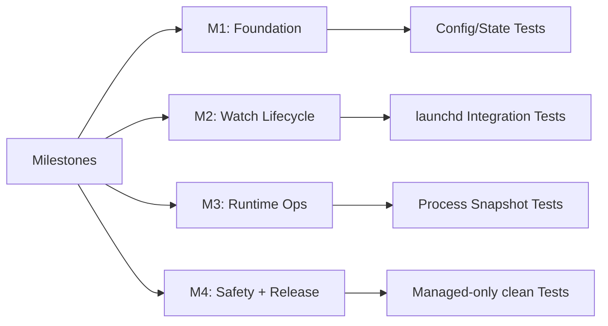

# 06 Rollout And Acceptance

## 1. 里程碑
1. M1：CLI 骨架 + 配置/状态存储 + 基础错误模型。
2. M2：watch/unwatch/watches + launchd 用户域托管。
3. M3：top/status + ad-hoc 管理 + instance_registry。
4. M4：clean 零误杀链路 + 验收测试 + 发布文档。

## 2. 验收标准
- 安全：`clean` 不清理手工 `cpulimit` 实例。
- 正确：规则增删改查一致，`unwatch` 只影响目标规则。
- 正确：`top` 默认创建 watch，`top --once` 才是一次性限速。
- 健壮：依赖缺失、权限不足、launchd 失败都有明确退出码。
- 性能：`top/status` 单次采样，避免重复全量扫描。
- 健壮：重启恢复不得生成等待中的 `cpulimit -e` 常驻进程。

## 3. 测试矩阵
| 类别 | 用例 | 期望 |
|---|---|---|
| 安全 | 预先手工运行 `cpulimit`，执行 `clean --yes` | 手工实例仍存活 |
| 正确 | `watch` 同名更新 | 规则被覆盖且仅一个条目 |
| 正确 | `top` 默认路径 | 选择进程后生成/更新 watch 规则 |
| 正确 | `top --once` 路径 | 不写 `rules.toml`，仅登记 ad-hoc 实例 |
| 正确 | `top` 批量终止同名异常进程 | 仅终止当前快照中 NAME 完全相同的非系统进程，并要求确认 |
| 正确 | `unwatch` 不存在规则 | 幂等返回，不破坏其他规则 |
| 健壮 | `watch` 前存在托管 ad-hoc 冲突 | 自动停止冲突实例并继续 |
| 健壮 | `watch` 前存在外部 ad-hoc 冲突 | 退出码 6，返回冲突提示 |
| 健壮 | 重启恢复 watch 规则 | launchd 托管 `cpuguard` runner，不出现等待中的 `cpulimit -e` 常驻进程 |
| 健壮 | `clean --yes` 遇到旧版 `com.cpuguard.*` plist | 仅清理受控 label 对应的 legacy plist，不影响外部 `cpulimit` |
| 健壮 | 移除 `cpulimit` 后运行命令 | 退出码 3，给安装提示 |
| 健壮 | `--domain system` 无权限 | 退出码 4，给提权建议 |
| 性能 | 200+ 进程执行 `status` | 单次刷新，响应在阈值内 |

## 4. 性能阈值（V1）
- `status`：200+ 进程场景下 P95 < 300ms。
- `top --count 10`：200+ 进程场景下 P95 < 350ms。
- 命令执行期间附加内存占用目标：< 30MB。

## 5. 发布检查单
- 文档一致性检查：`README.md` 与 `docs/03` 参数一致。
- 质量门禁：fmt、clippy、test 全通过。
- 回归检查：`clean` 零误杀用例必须通过。

## 6. 覆盖矩阵图

