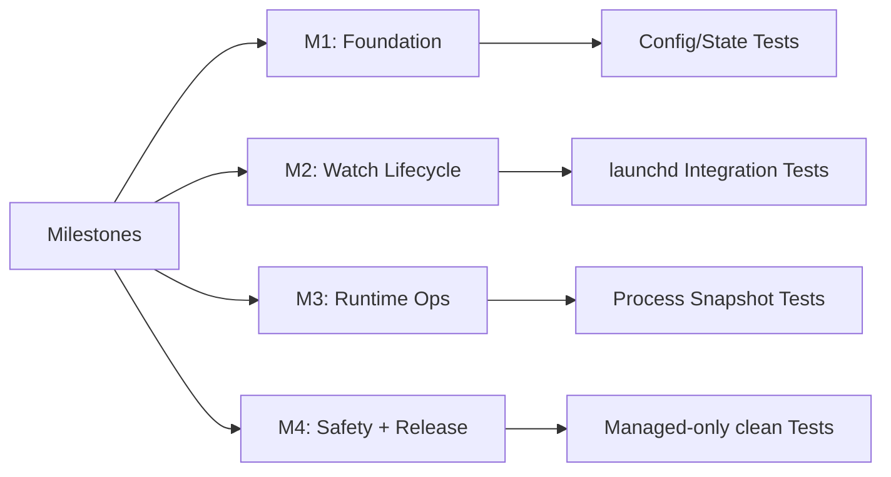

# 06 Rollout And Acceptance

## 1. 里程碑
1. M1：CLI 骨架 + 配置/状态存储 + 基础错误模型。
2. M2：watch/unwatch/watches + 单一 launchd agent 用户域托管。
3. M3：top/status + ad-hoc 管理 + instance_registry。
4. M4：agent 多 PID 自动限速 + 滞回 + backoff。
5. M5：clean 零误杀链路 + 验收测试 + 发布文档。

## 2. 验收标准
- 安全：`clean` 不清理手工 `cpulimit` 实例。
- 正确：规则增删改查一致，`unwatch` 只影响目标规则。
- 正确：无子命令默认展示只读 dashboard，包含 agent 状态、规则与当前被限制进程，不创建新规则。
- 正确：`top` 默认创建 watch，`top --once` 才是一次性限速。
- 健壮：依赖缺失、权限不足、launchd 失败都有明确退出码。
- 性能：`top/status` 单次采样，避免重复全量扫描。
- 性能：watch 规则共享单一 `com.cpuguard.agent`，不得为每条规则创建独立开机启动项。
- 健壮：重启恢复不得生成等待中的 `cpulimit -e` 常驻进程，也不得出现 per-rule runner 高速重启。
- 正确：同名多 PID 场景下，agent 只限制超过 `trigger_cpu` 且匹配规则的 PID。

## 3. 测试矩阵
| 类别 | 用例 | 期望 |
|---|---|---|
| 安全 | 预先手工运行 `cpulimit`，执行 `clean --yes` | 手工实例仍存活 |
| 正确 | `watch` 同名更新 | 规则被覆盖且仅一个条目 |
| 正确 | 无子命令默认执行 | 输出 dashboard，包含 agent status、watch rules 与 limited processes |
| 正确 | `top` 默认路径 | 选择进程后生成/更新 watch 规则 |
| 正确 | `top` 展示已限制 PID | 命中 running 托管实例的当前快照行显示 `LIMITED=YES` |
| 安全 | `top` 默认交互 | 不展示或执行 `k/x` 终止命令，仅允许限速、刷新、退出 |
| 安全 | `top --allow-kill` 终止动作 | 仅作用于当前快照，需确认，且禁止对系统进程触发 |
| 正确 | `top --once` 路径 | 不写 `rules.toml`，仅登记 ad-hoc 实例 |
| 正确 | `unwatch` 不存在规则 | 幂等返回，不破坏其他规则 |
| 正确 | `watches --domain user/system` | 只展示当前 domain 规则 |
| 健壮 | `watch` 前存在托管 ad-hoc 冲突 | 自动停止冲突实例并继续 |
| 健壮 | `watch` 替换托管 ad-hoc 但 agent 确认失败 | 不停止旧 ad-hoc，不写入 watch 规则 |
| 健壮 | `watch` 前存在外部 ad-hoc 冲突 | 退出码 6，返回冲突提示 |
| 健壮 | 重启恢复 watch 规则 | launchd 只托管 `com.cpuguard.agent`，不出现等待中的 `cpulimit -e` 常驻进程 |
| 正确 | 同名多进程仅部分高 CPU | 只为超过 `trigger_cpu` 的 PID 启动 `cpulimit` |
| 正确 | 同一配置目录同时存在 user/system 规则 | agent 只处理与自身 `--domain` 一致的规则和实例 |
| 正确 | 规则更新后目标不再匹配 `args_contains` | agent 停止旧实例并清理 state |
| 正确 | 目标 CPU 低于 `release_cpu` 连续多轮 | 停止对应托管 `cpulimit` 并清理 state |
| 健壮 | agent 清理 watch 实例时 `stop_instance` 失败 | 保留对应 state，后续扫描继续重试 |
| 健壮 | `kill -TERM` 成功但 `cpulimit_pid` 仍存活 | `stop_instance` 返回错误，不删除 state |
| 兼容 | v1 watch state 缺失 `rule_name` 但目标仍匹配规则 | agent 保留实例，不误停限速 |
| 兼容 | `unwatch` 命中 v1 watch state 缺失 `rule_name` | 停止 legacy watch 实例并清理 state |
| 正确 | `unwatch` 删除当前 domain 最后一条规则 | 先停止该规则 watch 实例，再卸载当前 domain agent |
| 健壮 | 单个 target 启动 `cpulimit` 或写 state 失败 | 该 target 进入 backoff，其它规则继续评估 |
| 正确 | `status --domain user/system` | 只展示当前 domain 实例，并显示 `DOMAIN` 列 |
| 正确 | 跨 domain 存在 managed ad-hoc | 不当作外部 `cpulimit` 冲突，也不自动停止其它 domain 实例 |
| 诊断 | user-domain watch 目标由其他 owner 持有且无 running 实例 | `watches` 在 `HINT` 列提示 `use --domain system` |
| 健壮 | 已托管 target 出现重复 `cpulimit` | 保留 state 登记实例，停止同 target 上其它重复 `cpulimit` |
| 健壮 | 已托管 target 的登记 `cpulimit_pid` 已退出但另有重复 `cpulimit` | 先停止重复 `cpulimit`，再清理 stale state 并进入 backoff |
| 健壮 | `cpulimit` 异常退出但目标仍高 CPU | agent 进入 backoff 后再重试，不高速重建 |
| 健壮 | `clean --yes` 遇到旧版 `com.cpuguard.*` plist | 仅清理受控 label 对应的 legacy plist，不影响外部 `cpulimit` |
| 健壮 | `clean --yes` 停止托管 `cpulimit` 失败 | 保留对应 state 和规则，返回错误供用户重试 |
| 健壮 | `install-agent` 成功加载新 agent 后 legacy plist 清理失败 | 命令仍返回成功，legacy 清理由后续 `clean --yes` 继续处理 |
| 健壮 | `clean --yes` 或最后一条 `unwatch` 卸载 agent 失败 | 返回错误，不静默报告成功 |
| 健壮 | 已 loaded 的 agent 执行 `launchctl bootout` 失败 | 返回错误，不删除当前 domain 规则 |
| 健壮 | `clean --yes` 或最后一条 `unwatch` 删规则后卸载 agent 失败 | 恢复删除前 rules 文件 |
| 健壮 | `install-agent` bootstrap 失败且旧 plist 存在但未 loaded | 恢复旧 plist 内容 |
| 健壮 | `install-agent` refresh 写入新 plist 后 bootout 失败 | 恢复旧 plist 内容 |
| 健壮 | 移除 `cpulimit` 后运行命令 | 退出码 3，给安装提示 |
| 健壮 | `--domain system` 无权限 | 退出码 4，给提权建议 |
| 性能 | 200+ 进程执行 `status` | 单次刷新，响应在阈值内 |

## 4. 性能阈值（V1）
- `status`：200+ 进程场景下 P95 < 300ms。
- `top --count 10`：200+ 进程场景下 P95 < 350ms。
- agent 空闲扫描周期默认不低于 15 秒；热点命中时可临时降到 5 秒。
- agent 空闲 CPU 长期目标：< 0.5%。
- agent 默认托管 `cpulimit` 实例上限：8。
- 命令执行期间附加内存占用目标：< 30MB。

## 5. 发布检查单
- 文档一致性检查：`README.md` 与 `docs/03` 参数一致。
- 质量门禁：fmt、clippy、test 全通过。
- 回归检查：`clean` 零误杀用例必须通过。

## 6. 覆盖矩阵图

